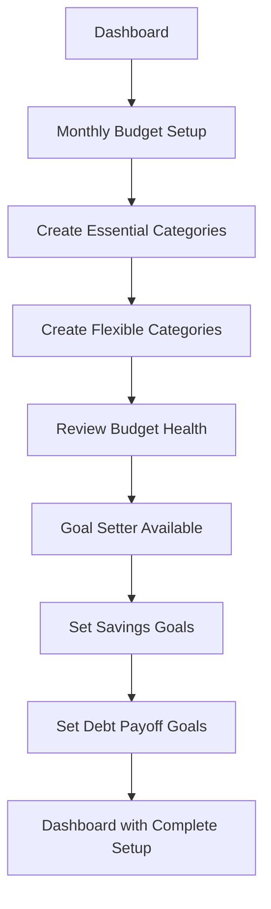
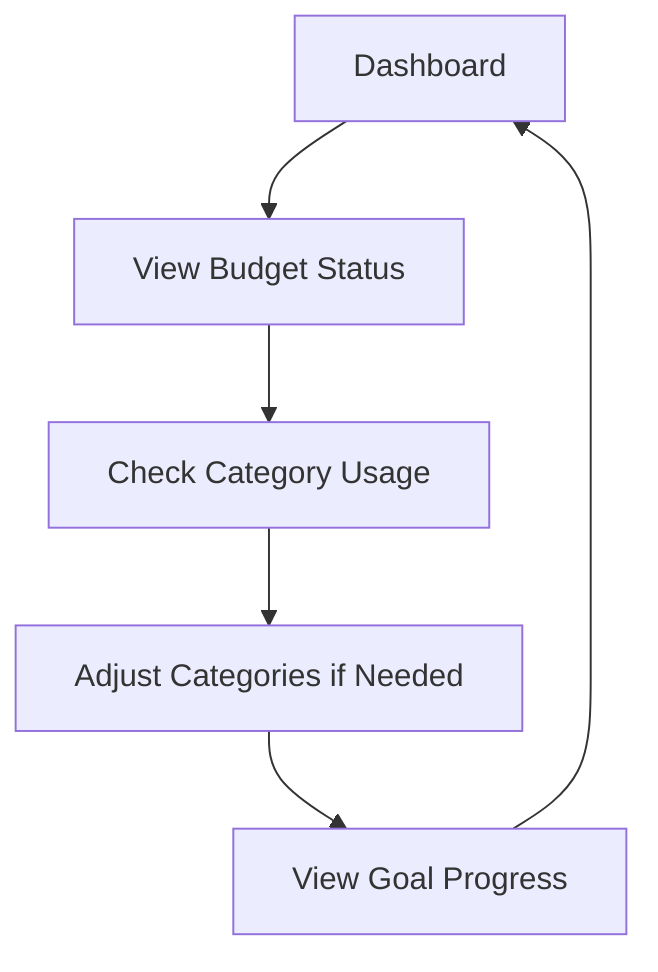

# Frontend Specification: Dashboard Redesign
**Simple Budget Application**

## Table of Contents
1. [Introduction](#introduction)
2. [Information Architecture](#information-architecture)
3. [User Flows](#user-flows)
4. [Component Library](#component-library)
5. [Visual Design](#visual-design)
6. [Responsive Design](#responsive-design)
7. [Implementation Notes](#implementation-notes)
8. [Developer Tasks](#developer-tasks)

---

## Introduction

### Project Context
The current Simple Budget application dashboard has confusing information architecture where the "Budget Wizard" mixes financial setup with goal setting, while "Budget Categories" serves as the actual budgeting tool. This redesign aims to clarify the user experience and create a more intuitive flow.

### UX Goals
1. **Clarity**: Separate budgeting from goal-setting functionality
2. **Intuitive Flow**: Guide users through Budget → Goals → Progress 
3. **Reduced Cognitive Load**: Clear visual hierarchy and progressive disclosure
4. **Encouraging Experience**: Maintain the app's calming, supportive tone

### Key Changes
- **Budget Wizard** → **Goal Setter** (intake data FROM budget categories)
- **Budget Categories** → **Monthly Budget** (primary budgeting tool)
- **Dashboard** → Reorganized with clear functional separation

---

## Information Architecture

### New Navigation Flow
```
Dashboard (Landing) 
├── Monthly Budget (Primary Tool)
│   ├── Essential Categories
│   ├── Flexible Categories  
│   └── Budget Analysis
├── Goal Setter (Secondary Tool)
│   ├── Savings Goals
│   ├── Debt Payoff Plans
│   └── Financial Milestones
└── Progress Tracking
    ├── Monthly Reports
    ├── Goal Progress
    └── Spending Analysis
```

### Dashboard Information Hierarchy
1. **Financial Health Status** (Hero Section)
2. **Monthly Budget Management** (Primary Action)
3. **Account Balances** (Quick Overview)
4. **Goal Setting** (Secondary Action)
5. **Progress Tracking** (Status Updates)
6. **Profile Management** (Tertiary)

---

## User Flows

### Primary User Flow: Budget Setup & Goal Creation


### Secondary User Flow: Daily Budget Management  


---

## Component Library

### Core Components

#### 1. Dashboard Cards
```typescript
interface DashboardCard {
  type: 'primary' | 'secondary' | 'info';
  title: string;
  subtitle?: string;
  content: ReactNode;
  actionButton?: {
    text: string;
    onClick: () => void;
    variant: 'primary' | 'secondary';
  };
  status?: 'success' | 'warning' | 'error' | 'neutral';
}
```

#### 2. Budget Progress Component
```typescript
interface BudgetProgress {
  totalBudget: number;
  usedAmount: number;
  userIncome: number;
  daysRemaining: number;
  status: 'excellent' | 'good' | 'warning' | 'over-budget';
}
```

#### 3. Category Preview Component
```typescript
interface CategoryPreview {
  categories: Array<{
    name: string;
    budgetAmount: number;
    usedAmount: number;
    isEssential: boolean;
  }>;
  showAll: boolean;
  onViewAll: () => void;
}
```

#### 4. Financial Health Hero
```typescript
interface FinancialHealthHero {
  status: 'excellent' | 'good' | 'attention' | 'concern';
  netWorth: number;
  statusMessage: string;
  icon: string;
}
```

---

## Visual Design

### Color Palette
- **Primary**: `#5A9BD4` (Blue) - Main actions, navigation
- **Success**: `#52B788` (Green) - Positive metrics, achievements
- **Warning**: `#F4A261` (Orange) - Attention items, over-budget
- **Accent**: `#9D4EDD` (Purple) - Goals, special features
- **Neutral**: 
  - Light: `#F8F9FA` (Background)
  - Medium: `#6C757D` (Secondary text)
  - Dark: `#212529` (Primary text)

### Typography
- **Headers**: 24px, Semibold, Primary color
- **Subheaders**: 18px, Medium weight
- **Body**: 16px, Regular
- **Data/Currency**: Monospace font for amounts
- **Labels**: 14px, Medium weight, Secondary color

### Card Design System
```scss
.dashboard-card {
  background: white;
  border-radius: 12px;
  padding: 24px;
  box-shadow: 0 2px 8px rgba(0,0,0,0.1);
  border: 1px solid #E9ECEF;
  transition: transform 0.2s ease;
  
  &:hover {
    transform: translateY(-2px);
    box-shadow: 0 4px 16px rgba(0,0,0,0.15);
  }
  
  &.primary-card {
    border-left: 4px solid var(--primary-color);
  }
  
  &.secondary-card {
    border-left: 4px solid var(--accent-color);
  }
}
```

### Icon System
- **Budget**: `category`, `account_balance_wallet`
- **Goals**: `flag`, `target`, `savings`
- **Progress**: `trending_up`, `bar_chart`, `timeline`
- **Status**: `check_circle`, `warning`, `error_outline`
- **Actions**: `add_circle`, `edit`, `arrow_forward`

---

## Responsive Design

### Breakpoints
- **Mobile**: `< 768px` - Single column, priority-based stacking
- **Tablet**: `768px - 1199px` - 2-column grid, condensed cards
- **Desktop**: `≥ 1200px` - 3-column grid, full expansion

### Layout Adaptations

#### Desktop (≥1200px)
```css
.dashboard-container {
  display: grid;
  grid-template-columns: 2fr 1fr 1fr;
  grid-template-areas: 
    "hero hero hero"
    "budget account-balance progress"
    "goals account-balance profile";
  gap: 24px;
}
```

#### Mobile (<768px)
```css
.dashboard-container {
  display: flex;
  flex-direction: column;
  gap: 16px;
}

/* Priority Order */
.hero { order: 1; }
.budget-status { order: 2; }
.quick-actions { order: 3; }
.account-summary { order: 4; }
.goals-preview { order: 5; }
```

---

## Implementation Notes

### Angular Component Structure
```
src/app/components/
├── dashboard/
│   ├── dashboard.component.ts
│   ├── dashboard.component.html
│   ├── dashboard.component.scss
│   └── components/
│       ├── financial-health-hero/
│       ├── budget-status-card/
│       ├── account-balance-card/
│       ├── goals-preview-card/
│       └── progress-summary-card/
```

### State Management Updates
```typescript
interface DashboardState {
  user: User;
  budgetSummary: BudgetSummary;
  goalsSummary: GoalsSummary;
  accounts: Account[];
  progressData: ProgressData;
  uiState: {
    loading: boolean;
    activeCard: string | null;
    showOnboarding: boolean;
  };
}
```

### Service Updates Required
1. **BudgetService**: Separate from wizard functionality
2. **GoalsService**: New service for goal management  
3. **DashboardService**: Enhanced with proper data aggregation
4. **ProgressService**: Track budget vs actual spending

---

## Developer Tasks

### Phase 1: Dashboard Structure (Priority: High)
- [ ] Create new dashboard component architecture
- [ ] Implement financial health hero component
- [ ] Build budget status card with progress visualization
- [ ] Create account balance summary card
- [ ] Implement responsive grid system

### Phase 2: Budget Categories Enhancement (Priority: High)
- [ ] Rename "Budget Categories" to "Monthly Budget" 
- [ ] Enhance category management UI
- [ ] Add budget health indicators
- [ ] Implement spending progress bars
- [ ] Add category suggestions based on income

### Phase 3: Goal Setter Transformation (Priority: Medium)
- [ ] Rename "Budget Wizard" to "Goal Setter"
- [ ] Remove income/expense setup from wizard
- [ ] Focus on savings goals and debt payoff plans
- [ ] Integrate with budget categories data
- [ ] Add goal progress tracking

### Phase 4: Navigation & Flow (Priority: Medium)  
- [ ] Update routing for new component names
- [ ] Implement progressive disclosure patterns
- [ ] Add guided onboarding flow
- [ ] Create contextual help tooltips
- [ ] Update navigation breadcrumbs

### Phase 5: Polish & Testing (Priority: Low)
- [ ] Implement micro-interactions
- [ ] Add loading states and skeleton screens
- [ ] Performance optimization
- [ ] Accessibility testing and improvements
- [ ] Cross-browser testing

### Files to Modify
1. `apps/web/src/app/components/dashboard.component.ts` - Main dashboard logic
2. `apps/web/src/app/features/budget-setup/budget-wizard.component.ts` - Transform to goal setter
3. `apps/web/src/app/features/budget-setup/budget-categories.component.ts` - Enhance as primary tool
4. `apps/web/src/app/app.routes.ts` - Update routing
5. `apps/web/src/app/services/` - Update service architecture

### New Components to Create
1. `FinancialHealthHeroComponent`
2. `BudgetStatusCardComponent`  
3. `GoalsPreviewCardComponent`
4. `ProgressSummaryCardComponent`
5. `QuickActionsComponent`

---

## Success Metrics
- **User Confusion**: Reduce support tickets about navigation by 60%
- **Task Completion**: Increase budget setup completion rate by 40%
- **User Engagement**: Increase daily active usage by 25%
- **Goal Setting**: Increase goal creation by 50% (after budget setup)

## Timeline Estimate
- **Phase 1-2**: 2-3 weeks
- **Phase 3-4**: 2 weeks  
- **Phase 5**: 1 week
- **Total**: 5-6 weeks

This redesign will create a much more intuitive and user-friendly experience while maintaining the encouraging, calming tone that makes Simple Budget special.