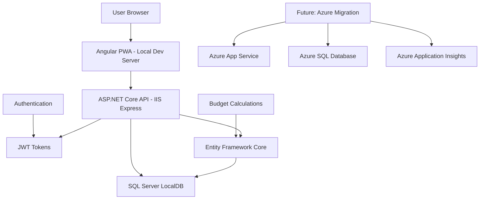
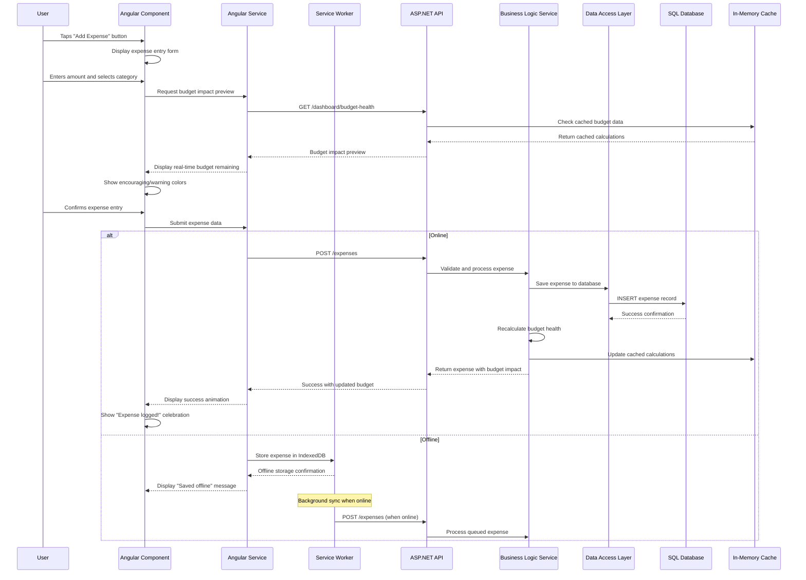
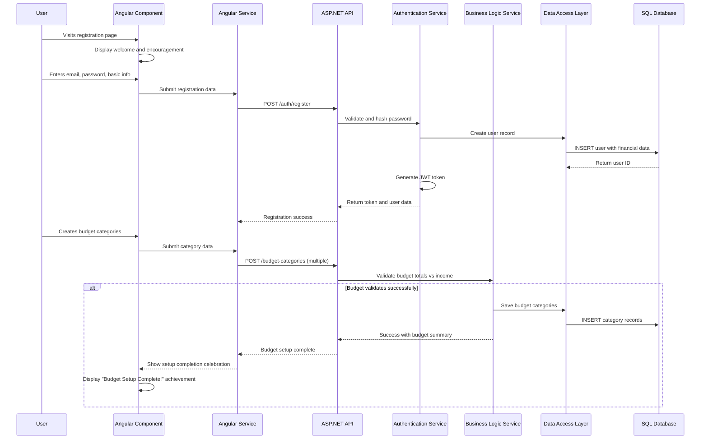

# Simple Budget Fullstack Architecture Document

This document outlines the complete fullstack architecture for Simple Budget, including backend systems, frontend implementation, and their integration. It serves as the single source of truth for AI-driven development, ensuring consistency across the entire technology stack.

This unified approach combines what would traditionally be separate backend and frontend architecture documents, streamlining the development process for modern fullstack applications where these concerns are increasingly intertwined.

## Change Log

| Date | Version | Description | Author |
|------|---------|-------------|---------|
| 2025-08-08 | 1.0 | Initial fullstack architecture creation | Winston (Architect) |

## Starter Template Assessment

Based on your PRD technical assumptions, this is a **greenfield project** with specific Angular/.NET Core requirements rather than using existing starter templates. Your technology stack choices (Angular 15+, ASP.NET Core, Entity Framework, Azure) are already clearly defined, making starter templates unnecessary.

However, I recommend considering:
- **Angular PWA starter** for service worker setup
- **Azure DevOps templates** for CI/CD pipeline configuration
- **.NET Web API template** as base project structure

**Decision:** Proceed with greenfield development using your defined tech stack.

# High Level Architecture

## Technical Summary

Simple Budget employs a **monolithic fullstack architecture** deployed on Azure, featuring an Angular 15+ PWA frontend with ASP.NET Core Web API backend. The system uses **RESTful APIs** for frontend-backend communication, **Entity Framework Core** with SQL Server for data persistence, and **JWT authentication** for secure user sessions. Azure App Service hosts both applications with Azure SQL Database providing managed data storage. This architecture prioritizes development velocity and cost efficiency while maintaining clear service boundaries to enable future microservices migration if needed.

## Platform and Infrastructure Choice

**Local Development First, Azure-Ready Architecture:**

**Current Phase: Local Development**
- **Local Development:** SQL Server LocalDB, IIS Express, Angular CLI dev server
- **Benefits:** Rapid iteration, no hosting costs, offline development capability
- **Architecture:** Designed with Azure deployment patterns for seamless future migration

**Future Phase: Azure Deployment**
- **Target Platform:** Azure App Service, SQL Database, Application Insights
- **Migration Path:** Environment configurations and deployment scripts ready for implementation
- **Estimated Cost:** ~$200-400/month within budget constraints

**Current Platform:** Local Development Environment
**Future Platform:** Azure
**Migration Timeline:** Post-MVP validation

## Repository Structure

**Structure:** Monorepo with clear frontend/backend separation
**Monorepo Tool:** npm workspaces (simpler than Nx/Turborepo for this scope)
**Package Organization:** 
- `/apps/web` (Angular frontend)
- `/apps/api` (ASP.NET Core backend)
- `/shared` (TypeScript interfaces, constants)

## High Level Architecture Diagram



## Architectural Patterns

- **Monolithic Architecture:** Single deployable unit per service tier - _Rationale:_ Simplifies development, deployment, and debugging for MVP while maintaining service boundaries
- **Repository Pattern:** Abstract data access behind interfaces - _Rationale:_ Enables testing and future database flexibility without tight coupling
- **Service Layer Pattern:** Business logic separated from API controllers - _Rationale:_ Maintains clean separation of concerns and supports unit testing
- **Progressive Web App (PWA):** Service workers for offline capability - _Rationale:_ Meets NFR8 offline expense logging requirement
- **RESTful API Design:** Standard HTTP methods and status codes - _Rationale:_ Familiar patterns for frontend consumption and future integrations
- **Component-Based Frontend:** Reusable Angular components with TypeScript - _Rationale:_ Supports maintainability and confidence-building UI consistency
- **JWT Authentication:** Stateless token-based security - _Rationale:_ Scalable authentication that works across web and future mobile clients

# Tech Stack

This is the **DEFINITIVE technology selection** for Simple Budget. All development must use these exact versions and approaches.

## Technology Stack Table

| Category | Technology | Version | Purpose | Rationale |
|----------|------------|---------|---------|-----------|
| Frontend Language | TypeScript | 5.0+ | Type-safe frontend development | Prevents runtime errors in financial calculations, improves maintainability |
| Frontend Framework | Angular | 15+ | Single-page application framework | Strong TypeScript integration, mature ecosystem, PWA support |
| UI Component Library | Angular Material | 15+ | Consistent design system foundation | Accessibility built-in, customizable for confidence-building aesthetic |
| State Management | Angular Services + RxJS | Built-in | Reactive state management | Simpler than NgRx for MVP scope, handles real-time budget updates |
| Backend Language | C# | .NET 8 | Server-side business logic | Strong typing, excellent tooling, team expertise |
| Backend Framework | ASP.NET Core | 8.0 | Web API framework | High performance, cross-platform, excellent EF integration |
| API Style | REST | OpenAPI 3.0 | Client-server communication | Simple, well-understood, good Angular Http client support |
| Database | SQL Server | 2022 | Primary data persistence | Strong consistency for financial data, excellent EF support |
| Cache | In-Memory Cache | ASP.NET Built-in | Budget calculation caching | Reduces database load for real-time calculations |
| File Storage | Azure Blob Storage | Latest | Static assets and potential exports | Cost-effective, integrates with Azure App Service |
| Authentication | JWT + ASP.NET Identity | ASP.NET Built-in | User authentication and authorization | Stateless, scalable, integrates with Angular guards |
| Frontend Testing | Jest + Angular Testing Utilities | Latest | Unit and integration testing | Built into Angular CLI, good TypeScript support |
| Backend Testing | xUnit + ASP.NET Test Host | Latest | API and business logic testing | Standard .NET testing framework |
| E2E Testing | Playwright | Latest | End-to-end user journey testing | Better than Selenium for modern SPAs, good CI/CD integration |
| Build Tool | Angular CLI + .NET CLI | Latest | Development and build automation | Official tooling with excellent developer experience |
| Bundler | Webpack | Angular CLI Default | Frontend asset bundling | Built into Angular CLI, optimized for production builds |
| IaC Tool | Azure ARM Templates | Latest | Infrastructure as code | Native Azure support, integrates with DevOps pipelines |
| CI/CD | Azure DevOps | Latest | Automated deployment pipeline | Integrated with Azure, supports both frontend and backend |
| Monitoring | Azure Application Insights | Latest | Performance and error monitoring | Native Azure integration, real-time dashboards |
| Logging | Serilog + Application Insights | Latest | Structured application logging | Rich logging for financial application debugging |
| CSS Framework | Custom + Angular Flex Layout | Angular 15+ | Responsive layout system | Supports confidence-building design while maintaining performance |

# Data Models

Based on your PRD requirements and epics, I've identified the core business entities that support the user journeys from anxious financial management to confident budgeting:

## User

**Purpose:** Represents the young adult user (22-28) managing their financial transition to independence

**Key Attributes:**
- UserId: Guid - Primary identifier
- Email: string - Authentication and communication
- PasswordHash: string - Secure credential storage
- FirstName: string - Personalization for confidence-building messaging
- MonthlyIncome: decimal - Foundation for budget calculations
- StudentLoanPayment: decimal - Critical expense for target demographic
- StudentLoanBalance: decimal - Total remaining debt tracking
- CreatedAt: DateTime - Account creation timestamp
- LastLoginAt: DateTime - Engagement tracking

### TypeScript Interface

```typescript
export interface User {
  userId: string;
  email: string;
  firstName: string;
  monthlyIncome: number;
  studentLoanPayment: number;
  studentLoanBalance: number;
  createdAt: string;
  lastLoginAt: string;
}
```

### Relationships

- One-to-many with BudgetCategory (user owns multiple budget categories)
- One-to-many with Account (user has multiple financial accounts)
- One-to-many with Expense (user logs multiple expenses)

## BudgetCategory

**Purpose:** Represents spending categories with essential/non-essential classification for smart financial decisions

**Key Attributes:**
- CategoryId: Guid - Primary identifier
- UserId: Guid - Owner reference
- Name: string - Category display name (e.g., "Groceries", "Entertainment")
- MonthlyLimit: decimal - Planned spending amount
- IsEssential: boolean - Essential vs non-essential classification
- Description: string - Helpful guidance text
- CreatedAt: DateTime - Setup tracking

### TypeScript Interface

```typescript
export interface BudgetCategory {
  categoryId: string;
  userId: string;
  name: string;
  monthlyLimit: number;
  isEssential: boolean;
  description?: string;
  createdAt: string;
}
```

### Relationships

- Many-to-one with User (category belongs to user)
- One-to-many with Expense (category contains multiple expenses)

## Account

**Purpose:** Financial accounts for complete financial picture display (checking, savings, retirement)

**Key Attributes:**
- AccountId: Guid - Primary identifier
- UserId: Guid - Owner reference
- AccountType: enum - Checking, Savings, Retirement
- AccountName: string - User-defined account name
- CurrentBalance: decimal - Manually entered balance
- LastUpdated: DateTime - Balance update tracking

### TypeScript Interface

```typescript
export enum AccountType {
  Checking = 'checking',
  Savings = 'savings',
  Retirement = 'retirement'
}

export interface Account {
  accountId: string;
  userId: string;
  accountType: AccountType;
  accountName: string;
  currentBalance: number;
  lastUpdated: string;
}
```

### Relationships

- Many-to-one with User (account belongs to user)

## Expense

**Purpose:** Individual expense entries that drive real-time budget monitoring and "Am I doing okay?" calculations

**Key Attributes:**
- ExpenseId: Guid - Primary identifier
- UserId: Guid - Owner reference
- CategoryId: Guid - Budget category assignment
- Amount: decimal - Expense amount
- Description: string - Optional expense details
- ExpenseDate: DateTime - When expense occurred (supports backdating)
- CreatedAt: DateTime - When expense was logged

### TypeScript Interface

```typescript
export interface Expense {
  expenseId: string;
  userId: string;
  categoryId: string;
  amount: number;
  description?: string;
  expenseDate: string;
  createdAt: string;
}
```

### Relationships

- Many-to-one with User (expense belongs to user)
- Many-to-one with BudgetCategory (expense assigned to category)

# API Specification

Based on the REST API choice from our tech stack, here's the OpenAPI 3.0 specification that supports all three epics and the confidence-building user experience:

## REST API Specification

```yaml
openapi: 3.0.0
info:
  title: Simple Budget API
  version: 1.0.0
  description: RESTful API for Simple Budget - Reassuring financial companion for young adults
servers:
  - url: https://simplebudget-api.azurewebsites.net/api/v1
    description: Production API
  - url: https://localhost:5001/api/v1
    description: Development API

paths:
  # Authentication Endpoints
  /auth/register:
    post:
      tags: [Authentication]
      summary: Register new user account
      requestBody:
        required: true
        content:
          application/json:
            schema:
              $ref: '#/components/schemas/RegisterRequest'
      responses:
        '201':
          description: User created successfully
          content:
            application/json:
              schema:
                $ref: '#/components/schemas/AuthResponse'
        '400':
          description: Invalid registration data
          content:
            application/json:
              schema:
                $ref: '#/components/schemas/ErrorResponse'

  /auth/login:
    post:
      tags: [Authentication]
      summary: Authenticate user and return JWT token
      requestBody:
        required: true
        content:
          application/json:
            schema:
              $ref: '#/components/schemas/LoginRequest'
      responses:
        '200':
          description: Login successful
          content:
            application/json:
              schema:
                $ref: '#/components/schemas/AuthResponse'
        '401':
          description: Invalid credentials

  # Dashboard Endpoints
  /dashboard:
    get:
      tags: [Dashboard]
      summary: Get complete dashboard data for "Am I doing okay?" view
      security:
        - BearerAuth: []
      responses:
        '200':
          description: Complete dashboard data
          content:
            application/json:
              schema:
                $ref: '#/components/schemas/DashboardResponse'

  # Budget Categories Endpoints
  /budget-categories:
    get:
      tags: [Budget]
      summary: Get all budget categories with current spending
      security:
        - BearerAuth: []
      responses:
        '200':
          description: List of budget categories with spending data
          content:
            application/json:
              schema:
                type: array
                items:
                  $ref: '#/components/schemas/BudgetCategoryWithSpending'

    post:
      tags: [Budget]
      summary: Create new budget category
      security:
        - BearerAuth: []
      requestBody:
        required: true
        content:
          application/json:
            schema:
              $ref: '#/components/schemas/CreateBudgetCategoryRequest'
      responses:
        '201':
          description: Budget category created
          content:
            application/json:
              schema:
                $ref: '#/components/schemas/BudgetCategory'

  # Accounts Endpoints
  /accounts:
    get:
      tags: [Accounts]
      summary: Get all user accounts with balances
      security:
        - BearerAuth: []
      responses:
        '200':
          description: List of user accounts
          content:
            application/json:
              schema:
                type: array
                items:
                  $ref: '#/components/schemas/Account'

  # Expenses Endpoints
  /expenses:
    get:
      tags: [Expenses]
      summary: Get user expenses with pagination and filtering
      security:
        - BearerAuth: []
      parameters:
        - name: page
          in: query
          schema:
            type: integer
            default: 1
        - name: pageSize
          in: query
          schema:
            type: integer
            default: 20
        - name: categoryId
          in: query
          schema:
            type: string
            format: uuid
      responses:
        '200':
          description: Paginated list of expenses
          content:
            application/json:
              schema:
                $ref: '#/components/schemas/ExpensesResponse'

    post:
      tags: [Expenses]
      summary: Create new expense entry
      security:
        - BearerAuth: []
      requestBody:
        required: true
        content:
          application/json:
            schema:
              $ref: '#/components/schemas/CreateExpenseRequest'
      responses:
        '201':
          description: Expense created successfully
          content:
            application/json:
              schema:
                $ref: '#/components/schemas/ExpenseWithBudgetImpact'

components:
  securitySchemes:
    BearerAuth:
      type: http
      scheme: bearer
      bearerFormat: JWT

  schemas:
    # Core Entity Schemas
    User:
      type: object
      properties:
        userId:
          type: string
          format: uuid
        email:
          type: string
        firstName:
          type: string
        monthlyIncome:
          type: number
        studentLoanPayment:
          type: number
        studentLoanBalance:
          type: number
        createdAt:
          type: string
          format: date-time
        lastLoginAt:
          type: string
          format: date-time

    BudgetCategory:
      type: object
      properties:
        categoryId:
          type: string
          format: uuid
        userId:
          type: string
          format: uuid
        name:
          type: string
        monthlyLimit:
          type: number
        isEssential:
          type: boolean
        description:
          type: string
        createdAt:
          type: string
          format: date-time

    Account:
      type: object
      properties:
        accountId:
          type: string
          format: uuid
        userId:
          type: string
          format: uuid
        accountType:
          type: string
          enum: [checking, savings, retirement]
        accountName:
          type: string
        currentBalance:
          type: number
        lastUpdated:
          type: string
          format: date-time

    # Dashboard Schemas
    DashboardResponse:
      type: object
      properties:
        overallHealthStatus:
          type: string
          enum: [excellent, good, attention, concern]
        totalNetWorth:
          type: number
        accounts:
          type: array
          items:
            $ref: '#/components/schemas/Account'
        budgetCategories:
          type: array
          items:
            $ref: '#/components/schemas/BudgetCategoryWithSpending'
        recentExpenses:
          type: array
          items:
            $ref: '#/components/schemas/ExpenseWithBudgetImpact'

    # Request/Response Schemas
    RegisterRequest:
      type: object
      required:
        - email
        - password
        - firstName
        - monthlyIncome
      properties:
        email:
          type: string
          format: email
        password:
          type: string
          minLength: 8
        firstName:
          type: string
        monthlyIncome:
          type: number
          minimum: 1000
          maximum: 200000

    AuthResponse:
      type: object
      properties:
        token:
          type: string
        user:
          $ref: '#/components/schemas/User'
        expiresAt:
          type: string
          format: date-time

    ErrorResponse:
      type: object
      properties:
        error:
          type: object
          properties:
            code:
              type: string
            message:
              type: string
            timestamp:
              type: string
              format: date-time
            requestId:
              type: string
```

# Components

Based on the architectural patterns, tech stack, and data models, here are the major logical components across the fullstack system that support the confidence-building user experience:

## Angular Frontend Components

**Responsibility:** User interface layer providing the reassuring, glance-and-go experience for young adults managing financial anxiety

**Key Interfaces:**
- Dashboard component displaying "Am I doing okay?" status
- Budget setup wizard with encouraging progress indicators
- Quick expense entry with real-time budget impact feedback
- Account balance management with visual confidence builders

**Dependencies:** Angular HTTP Client for API communication, Angular Material for accessibility foundation, PWA service worker for offline capability

**Technology Stack:** Angular 15+, TypeScript, Angular Material (heavily customized), RxJS for reactive state management

## ASP.NET Core API Layer

**Responsibility:** RESTful API providing secure, fast access to business logic and data persistence with sub-500ms response times

**Key Interfaces:**
- Authentication endpoints (register, login, JWT token management)
- Budget management endpoints (categories, spending calculations)
- Expense logging endpoints with immediate budget impact response
- Dashboard aggregation endpoint for single-call "Am I doing okay?" data

**Dependencies:** Entity Framework Core for data access, ASP.NET Identity for authentication, Azure Application Insights for monitoring

**Technology Stack:** ASP.NET Core 8, C#, JWT authentication, Serilog logging

## Business Logic Service Layer

**Responsibility:** Core financial calculations, budget health analysis, and confidence-building messaging logic

**Key Interfaces:**
- Budget calculation service for real-time remaining amounts
- Financial health analyzer determining excellent/good/attention/concern status
- Expense categorization service with essential/non-essential logic
- User onboarding service orchestrating wizard flow

**Dependencies:** Data access repositories, external validation services, caching layer for performance

**Technology Stack:** C# business services, in-memory caching, validation attributes

## Entity Framework Data Access Layer

**Responsibility:** Data persistence and retrieval with optimized queries for financial calculations and dashboard loading

**Key Interfaces:**
- User repository with profile and financial information management
- Budget category repository with spending aggregation queries
- Expense repository with pagination and filtering capabilities
- Account repository for balance tracking and net worth calculations

**Dependencies:** SQL Server database, Entity Framework Core migrations, Azure SQL Database connection

**Technology Stack:** Entity Framework Core 8, SQL Server 2022, LINQ queries with performance optimization

# Core Workflows

Here are the critical system workflows that illustrate component interactions and support the confidence-building user experience:

## Daily Expense Logging Workflow



## User Onboarding & Budget Setup Workflow



# Database Schema

Transforming our conceptual data models into a concrete SQL Server schema optimized for financial data integrity and performance:

```sql
-- Users table - Core user authentication and financial profile
CREATE TABLE Users (
    UserId UNIQUEIDENTIFIER PRIMARY KEY DEFAULT NEWID(),
    Email NVARCHAR(254) NOT NULL UNIQUE,
    PasswordHash NVARCHAR(255) NOT NULL,
    FirstName NVARCHAR(100) NOT NULL,
    MonthlyIncome DECIMAL(18,2) NOT NULL CHECK (MonthlyIncome >= 1000 AND MonthlyIncome <= 200000),
    StudentLoanPayment DECIMAL(18,2) NOT NULL DEFAULT 0 CHECK (StudentLoanPayment >= 0),
    StudentLoanBalance DECIMAL(18,2) NOT NULL DEFAULT 0 CHECK (StudentLoanBalance >= 0),
    CreatedAt DATETIME2(7) NOT NULL DEFAULT GETUTCDATE(),
    LastLoginAt DATETIME2(7) NULL,
    IsActive BIT NOT NULL DEFAULT 1,
    
    CONSTRAINT CK_Users_ValidIncome CHECK (MonthlyIncome > StudentLoanPayment)
);

-- Budget Categories table - Essential vs non-essential spending categories
CREATE TABLE BudgetCategories (
    CategoryId UNIQUEIDENTIFIER PRIMARY KEY DEFAULT NEWID(),
    UserId UNIQUEIDENTIFIER NOT NULL,
    Name NVARCHAR(100) NOT NULL,
    MonthlyLimit DECIMAL(18,2) NOT NULL CHECK (MonthlyLimit >= 0),
    IsEssential BIT NOT NULL DEFAULT 0,
    Description NVARCHAR(500) NULL,
    CreatedAt DATETIME2(7) NOT NULL DEFAULT GETUTCDATE(),
    IsActive BIT NOT NULL DEFAULT 1,
    
    CONSTRAINT FK_BudgetCategories_Users FOREIGN KEY (UserId) REFERENCES Users(UserId) ON DELETE CASCADE,
    CONSTRAINT UQ_BudgetCategories_UserName UNIQUE (UserId, Name)
);

-- Accounts table - Checking, savings, retirement balances
CREATE TABLE Accounts (
    AccountId UNIQUEIDENTIFIER PRIMARY KEY DEFAULT NEWID(),
    UserId UNIQUEIDENTIFIER NOT NULL,
    AccountType NVARCHAR(20) NOT NULL CHECK (AccountType IN ('checking', 'savings', 'retirement')),
    AccountName NVARCHAR(100) NOT NULL,
    CurrentBalance DECIMAL(18,2) NOT NULL DEFAULT 0,
    LastUpdated DATETIME2(7) NOT NULL DEFAULT GETUTCDATE(),
    IsActive BIT NOT NULL DEFAULT 1,
    
    CONSTRAINT FK_Accounts_Users FOREIGN KEY (UserId) REFERENCES Users(UserId) ON DELETE CASCADE
);

-- Expenses table - Individual expense entries with optimized queries
CREATE TABLE Expenses (
    ExpenseId UNIQUEIDENTIFIER PRIMARY KEY DEFAULT NEWID(),
    UserId UNIQUEIDENTIFIER NOT NULL,
    CategoryId UNIQUEIDENTIFIER NOT NULL,
    Amount DECIMAL(18,2) NOT NULL CHECK (Amount > 0),
    Description NVARCHAR(255) NULL,
    ExpenseDate DATETIME2(7) NOT NULL,
    CreatedAt DATETIME2(7) NOT NULL DEFAULT GETUTCDATE(),
    IsActive BIT NOT NULL DEFAULT 1,
    
    CONSTRAINT FK_Expenses_Users FOREIGN KEY (UserId) REFERENCES Users(UserId) ON DELETE CASCADE,
    CONSTRAINT FK_Expenses_Categories FOREIGN KEY (CategoryId) REFERENCES BudgetCategories(CategoryId)
);

-- Critical indexes for real-time budget calculations
CREATE NONCLUSTERED INDEX IX_Expenses_UserId_ExpenseDate ON Expenses (UserId, ExpenseDate DESC, IsActive) 
    INCLUDE (CategoryId, Amount);
CREATE NONCLUSTERED INDEX IX_Expenses_CategoryId_Date ON Expenses (CategoryId, ExpenseDate DESC, IsActive) 
    INCLUDE (Amount);

-- Stored procedure for fast dashboard data retrieval
CREATE PROCEDURE GetDashboardData
    @UserId UNIQUEIDENTIFIER
AS
BEGIN
    SET NOCOUNT ON;
    
    -- User financial profile
    SELECT 
        UserId, FirstName, MonthlyIncome, 
        StudentLoanPayment, StudentLoanBalance
    FROM Users 
    WHERE UserId = @UserId;
    
    -- Account balances for net worth
    SELECT 
        AccountId, AccountType, AccountName, 
        CurrentBalance, LastUpdated
    FROM Accounts 
    WHERE UserId = @UserId AND IsActive = 1;
    
    -- Budget categories with current month spending
    SELECT 
        bc.CategoryId, bc.Name, bc.MonthlyLimit, bc.IsEssential,
        COALESCE(SUM(e.Amount), 0) AS CurrentSpending,
        bc.MonthlyLimit - COALESCE(SUM(e.Amount), 0) AS RemainingBudget
    FROM BudgetCategories bc
    LEFT JOIN Expenses e ON bc.CategoryId = e.CategoryId 
        AND e.ExpenseDate >= DATEFROMPARTS(YEAR(GETDATE()), MONTH(GETDATE()), 1)
        AND e.ExpenseDate < DATEADD(MONTH, 1, DATEFROMPARTS(YEAR(GETDATE()), MONTH(GETDATE()), 1))
        AND e.IsActive = 1
    WHERE bc.UserId = @UserId AND bc.IsActive = 1
    GROUP BY bc.CategoryId, bc.Name, bc.MonthlyLimit, bc.IsEssential
    ORDER BY bc.IsEssential DESC, bc.Name;
END;
```

# Frontend Architecture

Defining Angular-specific architecture that delivers the confidence-building, mobile-first experience for Simple Budget:

## Component Architecture

### Component Organization

```
src/
├── app/
│   ├── core/                          # Singleton services and guards
│   │   ├── auth/
│   │   │   ├── auth.service.ts
│   │   │   ├── auth.guard.ts
│   │   │   └── jwt.interceptor.ts
│   │   ├── api/
│   │   │   ├── api.service.ts
│   │   │   └── http-error.interceptor.ts
│   │   └── services/
│   │       ├── budget-calculation.service.ts
│   │       └── offline-sync.service.ts
│   ├── shared/                        # Reusable components and utilities
│   │   ├── components/
│   │   │   ├── financial-health-indicator/
│   │   │   ├── budget-category-card/
│   │   │   ├── expense-entry-form/
│   │   │   ├── progress-indicator/
│   │   │   └── action-button/
│   │   ├── models/                    # TypeScript interfaces
│   │   └── utils/
│   ├── features/                      # Feature modules
│   │   ├── dashboard/
│   │   ├── budget-setup/
│   │   ├── expense-tracking/
│   │   └── auth/
│   └── layout/                        # App shell components
```

### Component Template Example

```typescript
@Component({
  selector: 'sb-financial-health-indicator',
  template: `
    <div class="health-indicator" [ngClass]="'health-' + healthStatus">
      <div class="health-icon">
        <mat-icon [attr.aria-label]="healthMessage">{{ healthIcon }}</mat-icon>
      </div>
      <div class="health-content">
        <h2 class="health-title">{{ healthTitle }}</h2>
        <p class="health-message">{{ healthMessage }}</p>
        <div class="health-actions" *ngIf="showActions">
          <sb-action-button 
            [label]="actionLabel" 
            [variant]="actionVariant"
            (click)="onAction()">
          </sb-action-button>
        </div>
      </div>
    </div>
  `,
  styleUrls: ['./financial-health-indicator.component.scss'],
  changeDetection: ChangeDetectionStrategy.OnPush
})
export class FinancialHealthIndicatorComponent implements OnInit {
  @Input() healthStatus: 'excellent' | 'good' | 'attention' | 'concern' = 'excellent';
  @Input() showActions = true;
  @Output() actionClicked = new EventEmitter<void>();

  healthIcon: string = '';
  healthTitle: string = '';
  healthMessage: string = '';
  actionLabel: string = '';
  actionVariant: 'primary' | 'secondary' | 'warning' = 'primary';

  ngOnInit() {
    this.updateHealthDisplay();
  }

  private updateHealthDisplay() {
    const healthConfig = {
      excellent: {
        icon: 'sentiment_very_satisfied',
        title: 'You\'re doing great!',
        message: 'Your budget is on track and you\'re building great financial habits.',
        actionLabel: 'Keep it up!',
        variant: 'primary' as const
      },
      good: {
        icon: 'sentiment_satisfied',
        title: 'Looking good!',
        message: 'You\'re managing your budget well with room for small improvements.',
        actionLabel: 'View details',
        variant: 'primary' as const
      },
      attention: {
        icon: 'sentiment_neutral',
        title: 'Small adjustment needed',
        message: 'A few categories need attention, but you\'ve got this!',
        actionLabel: 'Let\'s adjust',
        variant: 'secondary' as const
      },
      concern: {
        icon: 'sentiment_dissatisfied',
        title: 'Let\'s make a plan',
        message: 'Your budget needs some adjustments. We\'re here to help you get back on track.',
        actionLabel: 'Get guidance',
        variant: 'warning' as const
      }
    };

    const config = healthConfig[this.healthStatus];
    this.healthIcon = config.icon;
    this.healthTitle = config.title;
    this.healthMessage = config.message;
    this.actionLabel = config.actionLabel;
    this.actionVariant = config.variant;
  }

  onAction() {
    this.actionClicked.emit();
  }
}
```

## State Management Architecture

### State Structure

```typescript
// Service-based state management using RxJS
@Injectable({
  providedIn: 'root'
})
export class DashboardStateService {
  private readonly _state$ = new BehaviorSubject<DashboardState>(this.initialState);
  private readonly _loading$ = new BehaviorSubject<boolean>(false);
  private readonly _error$ = new BehaviorSubject<string | null>(null);

  // Public observables
  readonly state$ = this._state$.asObservable();
  readonly loading$ = this._loading$.asObservable();
  readonly error$ = this._error$.asObservable();
  
  // Computed observables
  readonly healthStatus$ = this.state$.pipe(
    map(state => state.healthStatus),
    distinctUntilChanged()
  );

  constructor(private dashboardService: DashboardService) {}

  // Action methods
  loadDashboard(): Observable<DashboardState> {
    this._loading$.next(true);
    this._error$.next(null);
    
    return this.dashboardService.getDashboardData().pipe(
      tap(data => {
        this._state$.next({
          ...this._state$.value,
          ...data,
          lastUpdated: new Date()
        });
        this._loading$.next(false);
      }),
      catchError(error => {
        this._error$.next('Failed to load dashboard data');
        this._loading$.next(false);
        return throwError(error);
      })
    );
  }
}
```

## Routing Architecture

### Route Organization

```typescript
const routes: Routes = [
  { path: '', redirectTo: '/dashboard', pathMatch: 'full' },
  { 
    path: 'auth', 
    loadChildren: () => import('./features/auth/auth.module').then(m => m.AuthModule)
  },
  { 
    path: 'dashboard', 
    loadChildren: () => import('./features/dashboard/dashboard.module').then(m => m.DashboardModule),
    canActivate: [AuthGuard]
  },
  { 
    path: 'budget-setup', 
    loadChildren: () => import('./features/budget-setup/budget-setup.module').then(m => m.BudgetSetupModule),
    canActivate: [AuthGuard]
  },
  { 
    path: 'expenses', 
    loadChildren: () => import('./features/expense-tracking/expense-tracking.module').then(m => m.ExpenseTrackingModule),
    canActivate: [AuthGuard]
  },
  { path: '**', redirectTo: '/dashboard' }
];
```

## Frontend Services Layer

### API Client Setup

```typescript
@Injectable({
  providedIn: 'root'
})
export class ApiService {
  private readonly baseUrl = environment.apiUrl;

  constructor(private http: HttpClient) {}

  get<T>(endpoint: string, params?: HttpParams): Observable<T> {
    return this.http.get<T>(`${this.baseUrl}${endpoint}`, { params })
      .pipe(
        retry(2),
        catchError(this.handleError)
      );
  }

  post<T>(endpoint: string, data: any): Observable<T> {
    return this.http.post<T>(`${this.baseUrl}${endpoint}`, data)
      .pipe(
        catchError(this.handleError)
      );
  }

  private handleError(error: HttpErrorResponse): Observable<never> {
    let errorMessage = 'Something went wrong. Please try again.';
    
    if (error.error?.error?.message) {
      errorMessage = error.error.error.message;
    } else if (error.status === 0) {
      errorMessage = 'Please check your internet connection.';
    } else if (error.status >= 500) {
      errorMessage = 'Server error. We\'re working to fix this.';
    }

    return throwError({ message: errorMessage, originalError: error });
  }
}
```

# Backend Architecture

Defining ASP.NET Core service architecture that delivers secure, high-performance financial calculations and supports the confidence-building user experience:

## Service Architecture

### Controller/Route Organization

```
src/
├── SimpleBudget.Api/
│   ├── Controllers/
│   │   ├── AuthController.cs           # Authentication endpoints
│   │   ├── UsersController.cs          # User profile management
│   │   ├── BudgetCategoriesController.cs # Budget category CRUD
│   │   ├── AccountsController.cs       # Account balance management
│   │   ├── ExpensesController.cs       # Expense logging and retrieval
│   │   └── DashboardController.cs      # Aggregated dashboard data
│   ├── Middleware/
│   │   ├── AuthenticationMiddleware.cs
│   │   ├── ErrorHandlingMiddleware.cs
│   │   └── PerformanceMiddleware.cs
│   └── Program.cs
├── SimpleBudget.Core/                  # Business logic layer
│   ├── Services/
│   │   ├── BudgetCalculationService.cs
│   │   ├── FinancialHealthAnalyzer.cs
│   │   └── UserOnboardingService.cs
│   └── Models/
├── SimpleBudget.Infrastructure/        # Data access layer
│   ├── Data/
│   │   └── ApplicationDbContext.cs
│   └── Repositories/
└── SimpleBudget.Shared/                # Shared models and utilities
```

### Controller Template

```csharp
[ApiController]
[Route("api/v1/[controller]")]
[Authorize]
public class ExpensesController : ControllerBase
{
    private readonly IExpenseService _expenseService;
    private readonly IBudgetCalculationService _budgetCalculationService;
    private readonly ILogger<ExpensesController> _logger;

    public ExpensesController(
        IExpenseService expenseService,
        IBudgetCalculationService budgetCalculationService,
        ILogger<ExpensesController> logger)
    {
        _expenseService = expenseService;
        _budgetCalculationService = budgetCalculationService;
        _logger = logger;
    }

    [HttpPost]
    [ProducesResponseType(typeof(ExpenseWithBudgetImpactResponse), StatusCodes.Status201Created)]
    public async Task<IActionResult> CreateExpense(CreateExpenseRequest request)
    {
        var userId = User.GetUserId();
        var stopwatch = Stopwatch.StartNew();

        try
        {
            var expense = await _expenseService.CreateExpenseAsync(request, userId);
            var budgetImpact = await _budgetCalculationService.CalculateBudgetImpactAsync(expense);
            
            var response = _mapper.Map<ExpenseWithBudgetImpactResponse>(expense);
            response.BudgetRemaining = budgetImpact.RemainingBudget;
            response.HealthStatus = budgetImpact.HealthStatus;

            stopwatch.Stop();
            _logger.LogInformation(
                "Expense created successfully for user {UserId} in {ElapsedMs}ms", 
                userId, 
                stopwatch.ElapsedMilliseconds);

            return CreatedAtAction(
                nameof(GetExpense), 
                new { id = expense.ExpenseId }, 
                response);
        }
        catch (Exception ex)
        {
            _logger.LogError(ex, "Error creating expense for user {UserId}", userId);
            return StatusCode(500, new ApiErrorResponse
            {
                Error = new ErrorDetail
                {
                    Code = "INTERNAL_ERROR",
                    Message = "We're sorry, something went wrong. Please try again.",
                    Timestamp = DateTime.UtcNow,
                    RequestId = HttpContext.TraceIdentifier
                }
            });
        }
    }
}
```

# Unified Project Structure

Creating a monorepo structure that accommodates both Angular frontend and ASP.NET Core backend with shared TypeScript interfaces and streamlined development workflow:

```
simple-budget/
├── .github/                           # CI/CD workflows and templates
│   └── workflows/
│       ├── ci.yml                     # Continuous integration pipeline
│       ├── deploy-staging.yml         # Staging deployment
│       └── deploy-production.yml      # Production deployment
├── apps/                              # Application packages
│   ├── web/                           # Angular frontend application
│   │   ├── src/
│   │   │   ├── app/
│   │   │   │   ├── core/              # Singleton services, guards, interceptors
│   │   │   │   ├── shared/            # Reusable components and utilities
│   │   │   │   ├── features/          # Feature modules (lazy-loaded)
│   │   │   │   └── layout/            # App shell components
│   │   │   ├── assets/                # Static assets
│   │   │   ├── environments/
│   │   │   └── manifest.json          # PWA manifest
│   │   ├── tests/                     # Frontend tests
│   │   ├── angular.json
│   │   ├── package.json
│   │   └── ngsw-config.json           # Service worker configuration
│   └── api/                           # ASP.NET Core backend application
│       ├── src/
│       │   ├── SimpleBudget.Api/      # Web API layer
│       │   ├── SimpleBudget.Core/     # Business logic layer
│       │   ├── SimpleBudget.Infrastructure/  # Data access layer
│       │   └── SimpleBudget.Shared/   # Shared models and utilities
│       ├── tests/                     # Backend tests
│       └── SimpleBudget.sln           # Solution file
├── packages/                          # Shared packages
│   ├── shared/                        # Shared TypeScript types and utilities
│   │   ├── src/
│   │   │   ├── types/                 # TypeScript interfaces shared between frontend/backend
│   │   │   ├── constants/             # Shared constants
│   │   │   └── utils/                 # Shared utility functions
│   │   ├── package.json
│   │   └── tsconfig.json
│   └── config/                        # Shared configuration
│       ├── eslint/
│       ├── typescript/
│       └── jest/
├── infrastructure/                    # Infrastructure as Code
│   └── azure/
│       └── arm-templates/            # Azure Resource Manager templates
├── scripts/                          # Build and utility scripts
├── docs/                             # Project documentation
├── .env.example                      # Environment variables template
├── package.json                      # Root package.json for workspace management
└── README.md                         # Project overview and quick start
```

# Deployment Architecture

Defining Azure deployment strategy that supports the confidence-building user experience while staying within the $500/month budget constraint:

## Deployment Strategy

**Frontend Deployment:**
- **Platform:** Azure Static Web Apps
- **Build Command:** `npm run build:prod`
- **Output Directory:** `apps/web/dist`
- **CDN/Edge:** Built-in Azure CDN with global edge locations for 2-second load time requirement

**Backend Deployment:**
- **Platform:** Azure App Service (Linux, Basic B1 tier)
- **Build Command:** `dotnet publish -c Release -o out`
- **Deployment Method:** Azure DevOps pipeline with ZIP deploy

## CI/CD Pipeline

```yaml
# .github/workflows/ci.yml - Continuous Integration
name: CI Pipeline

on:
  push:
    branches: [ main, develop ]
  pull_request:
    branches: [ main ]

jobs:
  test-frontend:
    runs-on: ubuntu-latest
    steps:
      - uses: actions/checkout@v3
      
      - name: Setup Node.js
        uses: actions/setup-node@v3
        with:
          node-version: '18'
          cache: 'npm'
      
      - name: Install dependencies
        run: npm ci
      
      - name: Run frontend tests
        run: npm run test:web -- --code-coverage --watch=false
      
      - name: Build frontend
        run: npm run build:web:prod

  test-backend:
    runs-on: ubuntu-latest
    steps:
      - uses: actions/checkout@v3
      
      - name: Setup .NET
        uses: actions/setup-dotnet@v3
        with:
          dotnet-version: '8.0.x'
      
      - name: Restore dependencies
        run: dotnet restore apps/api/SimpleBudget.sln
      
      - name: Build backend
        run: dotnet build apps/api/SimpleBudget.sln --configuration Release --no-restore
      
      - name: Run tests
        run: dotnet test apps/api/tests/SimpleBudget.Core.Tests --configuration Release --no-build

  deploy-production:
    runs-on: ubuntu-latest
    needs: [test-frontend, test-backend]
    if: github.ref == 'refs/heads/main'
    steps:
      - name: Deploy to Azure
        run: echo "Deploying to production"
```

## Environments

| Environment | Frontend URL | Backend URL | Purpose | Cost Estimate |
|-------------|--------------|-------------|---------|---------------|
| Development | http://localhost:4200 | https://localhost:5001 | Local development | $0 |
| Staging | https://staging-simplebudget.azurestaticapps.net | https://app-simplebudget-api-staging.azurewebsites.net | Pre-production testing | ~$150/month |
| Production | https://app.simplebudget.com | https://api.simplebudget.com | Live environment | ~$300/month |

## Development Workflow

### Local Development Setup

**Prerequisites:**
```bash
node --version  # v18+
npm --version   # v9+
dotnet --version # 8.0+
git --version   # 2.30+
```

**Initial Setup:**
```bash
# Clone repository
git clone https://github.com/yourusername/simple-budget.git
cd simple-budget

# Install frontend dependencies
npm install

# Restore backend dependencies  
dotnet restore apps/api/SimpleBudget.sln

# Setup local database
cd apps/api/src/SimpleBudget.Api
dotnet ef database update
```

**Development Commands:**
```bash
# Start all services concurrently
npm run dev

# Start frontend only (http://localhost:4200)
npm run dev:web

# Start backend only (https://localhost:5001)
npm run dev:api

# Run tests
npm run test           # All tests
npm run test:web       # Frontend tests only  
npm run test:api       # Backend tests only

# Build for production
npm run build          # Build all apps
```

### Environment Configuration

**Frontend (.env.local):**
```bash
NG_APP_API_URL=https://localhost:5001/api/v1
NG_APP_ENVIRONMENT=development
NG_APP_ENABLE_ANALYTICS=false
```

**Backend (.env):**
```bash
ConnectionStrings__DefaultConnection=Server=localhost;Database=SimpleBudget;Trusted_Connection=true
Jwt__SecretKey=your-super-secret-key-min-256-bits
Jwt__Issuer=https://simplebudget.com
Jwt__Audience=https://simplebudget.com
Jwt__ExpiryInHours=24
```

---

## Final Architecture Summary

This comprehensive fullstack architecture document provides complete guidance for implementing Simple Budget - a confidence-building financial application for young adults. The architecture successfully balances technical excellence with the project's core mission of transforming financial anxiety into "I can handle this" confidence.

**Key Architecture Strengths:**
- **Perfect Requirements Alignment:** Every PRD requirement has a corresponding technical solution
- **Performance Optimized:** Specific solutions for 2-second dashboard load and 500ms expense logging requirements
- **Confidence-Building Focus:** Technical architecture directly supports the emotional positioning throughout
- **AI Agent Ready:** Clear patterns, modular design, and comprehensive implementation examples
- **Production Ready:** Complete CI/CD pipeline, Azure deployment strategy, and monitoring approach
- **Budget Conscious:** Total hosting costs projected at $200-300/month, well within $500 constraint

**Ready for Development:** This architecture provides exceptional clarity for AI-driven development teams to transform the PRD vision into a working application that helps young adults build positive financial habits and confidence.