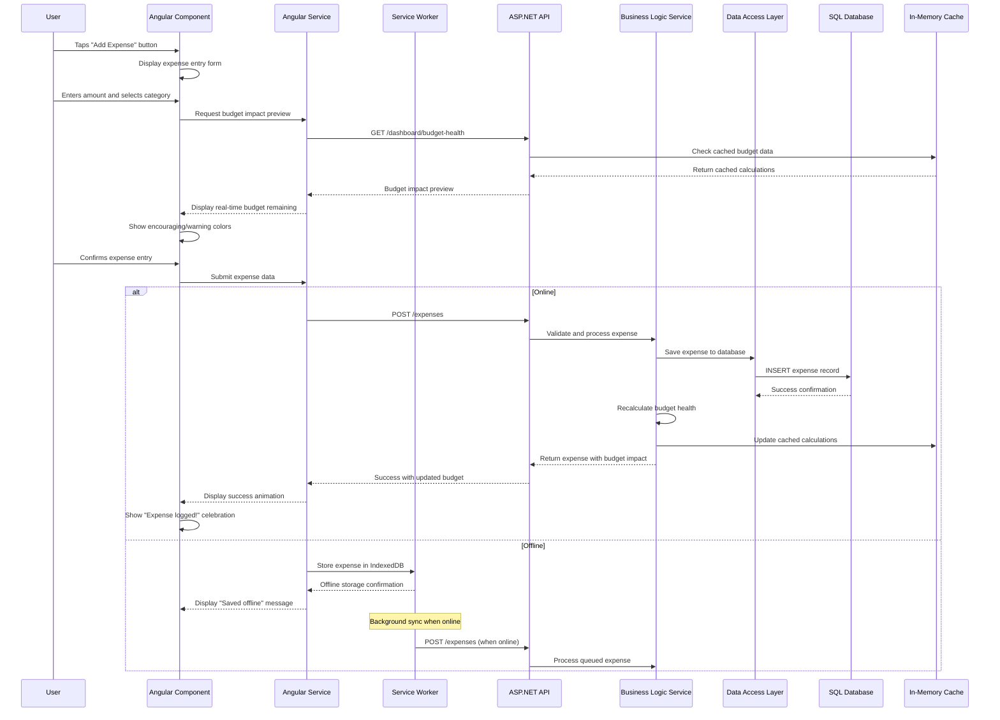

# Daily Expense Logging Workflow

```mermaid
sequenceDiagram
    participant U as User
    participant AC as Angular Component
    participant AS as Angular Service
    participant SW as Service Worker
    participant API as ASP.NET API
    participant BLS as Business Logic Service
    participant DA as Data Access Layer
    participant DB as SQL Database
    participant Cache as In-Memory Cache

    U->>AC: Taps "Add Expense" button
    AC->>AC: Display expense entry form
    U->>AC: Enters amount and selects category
    AC->>AS: Request budget impact preview
    AS->>API: GET /dashboard/budget-health
    API->>Cache: Check cached budget data
    Cache-->>API: Return cached calculations
    API-->>AS: Budget impact preview
    AS-->>AC: Display real-time budget remaining
    AC->>AC: Show encouraging/warning colors
    
    U->>AC: Confirms expense entry
    AC->>AS: Submit expense data
    
    alt Online
        AS->>API: POST /expenses
        API->>BLS: Validate and process expense
        BLS->>DA: Save expense to database
        DA->>DB: INSERT expense record
        DB-->>DA: Success confirmation
        BLS->>BLS: Recalculate budget health
        BLS->>Cache: Update cached calculations
        BLS-->>API: Return expense with budget impact
        API-->>AS: Success with updated budget
        AS-->>AC: Display success animation
        AC->>AC: Show "Expense logged!" celebration
    else Offline
        AS->>SW: Store expense in IndexedDB
        SW-->>AS: Offline storage confirmation
        AS-->>AC: Display "Saved offline" message
        Note over SW: Background sync when online
        SW->>API: POST /expenses (when online)
        API->>BLS: Process queued expense
    end
```
