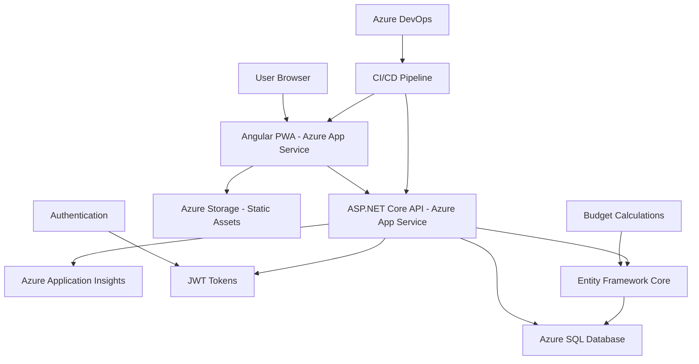

# High Level Architecture Diagram

```mermaid
graph TD
    A[User Browser] --> B[Angular PWA - Azure App Service]
    B --> C[ASP.NET Core API - Azure App Service]
    C --> D[Azure SQL Database]
    C --> E[Azure Application Insights]
    B --> F[Azure Storage - Static Assets]
    
    G[Azure DevOps] --> H[CI/CD Pipeline]
    H --> B
    H --> C
    
    I[Authentication] --> J[JWT Tokens]
    C --> J
    
    K[Budget Calculations] --> L[Entity Framework Core]
    C --> L
    L --> D
```
