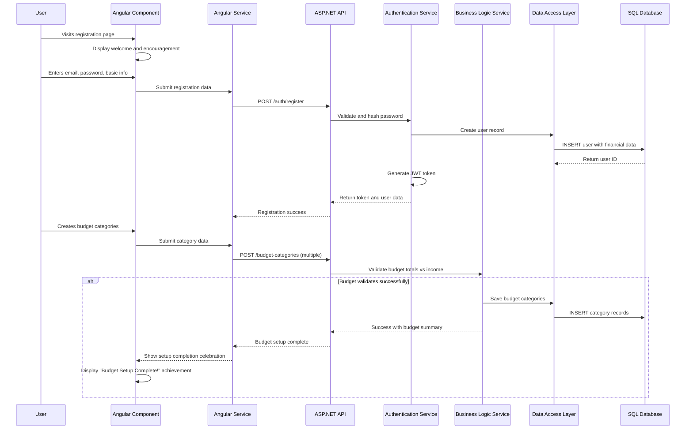

# User Onboarding & Budget Setup Workflow

```mermaid
sequenceDiagram
    participant U as User
    participant AC as Angular Component
    participant AS as Angular Service
    participant API as ASP.NET API
    participant Auth as Authentication Service
    participant BLS as Business Logic Service
    participant DA as Data Access Layer
    participant DB as SQL Database

    U->>AC: Visits registration page
    AC->>AC: Display welcome and encouragement
    U->>AC: Enters email, password, basic info
    AC->>AS: Submit registration data
    AS->>API: POST /auth/register
    API->>Auth: Validate and hash password
    Auth->>DA: Create user record
    DA->>DB: INSERT user with financial data
    DB-->>DA: Return user ID
    Auth->>Auth: Generate JWT token
    Auth-->>API: Return token and user data
    API-->>AS: Registration success
    
    U->>AC: Creates budget categories
    AC->>AS: Submit category data
    AS->>API: POST /budget-categories (multiple)
    API->>BLS: Validate budget totals vs income
    
    alt Budget validates successfully
        BLS->>DA: Save budget categories
        DA->>DB: INSERT category records
        BLS-->>API: Success with budget summary
        API-->>AS: Budget setup complete
        AS-->>AC: Show setup completion celebration
        AC->>AC: Display "Budget Setup Complete!" achievement
    end
```
