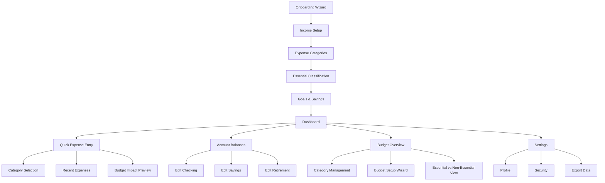
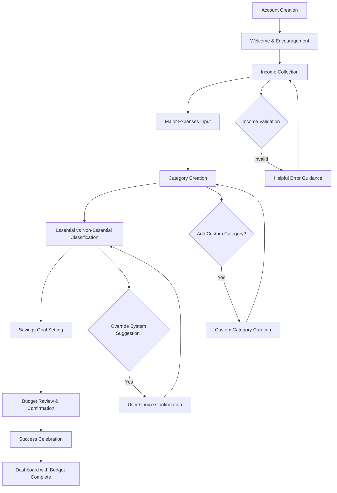
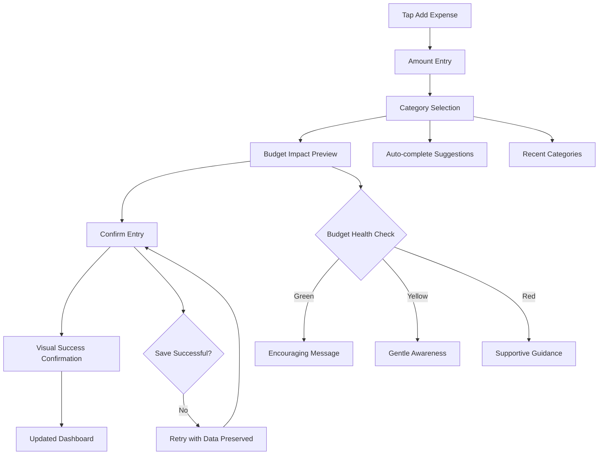
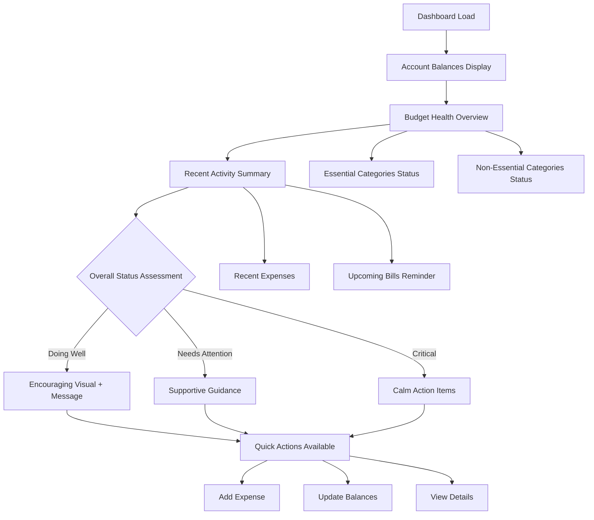

# Simple Budget UI/UX Specification

This document defines the user experience goals, information architecture, user flows, and visual design specifications for Simple Budget's user interface. It serves as the foundation for visual design and frontend development, ensuring a cohesive and user-centered experience.

## Introduction

### Overall UX Goals & Principles

#### Target User Personas

**Primary Persona: Financially Anxious Young Adult (22-28)**
- Fresh college graduate earning $30K-$50K
- Managing student loan obligations while building independence
- Experiences simultaneous excitement and financial stress
- Needs encouragement over complex features
- Most receptive to building positive financial habits

#### Usability Goals

- **Setup Completion:** 70% of users complete the guided onboarding wizard
- **Monthly Retention:** 60% of users return monthly for continued engagement
- **Daily Check-in Habit:** Dashboard answers "Am I doing okay?" at a glance
- **Quick Expense Logging:** 15-second expense entry to support daily habits
- **Confidence Building:** Transform "financial anxiety" into "I can handle this" mindset

#### Design Principles

1. **Reassuring over Overwhelming** - Emotional comfort takes priority over comprehensive data display
2. **Progressive Disclosure** - Advanced features hidden behind clean primary interface
3. **Encouraging Feedback** - Every interaction reinforces "I can handle this" messaging
4. **Visual Clarity over Complexity** - Essential vs. non-essential categorization with clear visual hierarchy
5. **Glance-and-Go Access** - Primary information visible without scrolling or clicking

### Change Log

| Date | Version | Description | Author |
|------|---------|-------------|---------|
| 2025-08-08 | 1.0 | Initial UI/UX specification creation | Sally (UX Expert) |

## Information Architecture (IA)

### Site Map / Screen Inventory

### Navigation Structure

**Primary Navigation:** Single-level tab bar focused on core daily actions:
- Dashboard (home/default)
- Add Expense (prominent action button)
- Budget Setup (accessible but not overwhelming)
- Settings (minimal, tucked away)

**Secondary Navigation:** Context-sensitive within each primary section, using progressive disclosure to avoid overwhelming new users while providing access for confident users

**Breadcrumb Strategy:** Minimal breadcrumbs only in Settings and Budget Setup areas. Dashboard and Expense Entry use modal/overlay patterns to maintain focus and reduce navigation complexity

## User Flows

### Flow 1: First-Time User Onboarding & Budget Setup

**User Goal:** Establish complete budget framework without feeling overwhelmed

**Entry Points:** Landing page signup, direct app link

**Success Criteria:** User completes wizard setup and sees encouraging "Budget Setup Complete" message on dashboard

#### Flow Diagram

#### Edge Cases & Error Handling:
- Income amount outside reasonable range ($1K-$200K) → Gentle validation with context
- Budget total exceeds income → Visual feedback with encouraging adjustment guidance
- User abandons wizard mid-flow → Save progress, email gentle reminder after 24 hours
- Technical errors during setup → Clear error messages with "try again" option, no data loss

**Notes:** Wizard must maintain encouraging tone throughout with progress indicators. Each step includes "you're doing great" messaging to build confidence.

### Flow 2: Daily Expense Logging

**User Goal:** Log expense in under 15 seconds while seeing immediate budget impact

**Entry Points:** Dashboard "Add Expense" button, quick-access from mobile home screen

**Success Criteria:** Expense saved, budget updated, encouraging feedback provided

#### Flow Diagram

#### Edge Cases & Error Handling:
- Network failure during save → Offline storage with sync when reconnected
- Category over budget → Supportive messaging, not alarming warnings
- Duplicate expense detection → "Did you mean to add this again?" gentle confirmation
- Invalid amount entry → Clear validation without frustration

**Notes:** Response time must be under 500ms per NFR2. Visual feedback uses encouraging colors, never harsh reds.

### Flow 3: Daily Dashboard Check-in

**User Goal:** Answer "Am I doing okay?" in a single glance

**Entry Points:** App launch, direct URL, mobile bookmark

**Success Criteria:** User sees financial health status and feels confident or supported

#### Flow Diagram

#### Edge Cases & Error Handling:
- Slow load times → Progressive loading with skeleton screens
- No recent activity → Encouraging "ready for today" messaging
- Multiple budget overages → Prioritize essential categories, supportive tone for guidance
- Account balance seems unrealistic → Gentle verification prompt

**Notes:** Must load under 2 seconds per NFR1. Visual hierarchy emphasizes "Am I doing okay?" answer immediately.

## Wireframes & Mockups

**Primary Design Files:** [To be created in Figma - will provide link once established]

### Key Screen Layouts

#### Dashboard (Glance-and-Go Answer to "Am I doing okay?")

**Purpose:** Central hub that immediately answers user's core question with encouraging visual hierarchy

**Key Elements:**
- **Financial Health Hero Section** - Large, prominent visual indicator using encouraging colors (green "You're doing great!" or warm yellow "Looking good, small adjustment needed")
- **Account Balances Card** - Clean display of checking, savings, retirement with subtle total net worth
- **Budget Status Overview** - Essential categories displayed first with remaining amounts, non-essential categories in secondary visual hierarchy
- **Recent Activity Feed** - Last 3-5 expenses with quick edit/category confirmation options
- **Primary Action Button** - "Add Expense" prominently placed but not overwhelming the status overview

**Interaction Notes:** Everything above the fold answers "Am I doing okay?" without scrolling. Progressive disclosure reveals more detail on tap/click. Uses soft shadows and rounded corners to feel approachable rather than sterile.

**Design File Reference:** [Dashboard - Mobile & Desktop frames in Figma]

#### Budget Setup Wizard (Confidence-Building Onboarding)

**Purpose:** Transform potentially overwhelming budget creation into encouraging, manageable steps

**Key Elements:**
- **Progress Indicator** - Visual progress bar with encouraging milestones ("Great start!", "Halfway there!", "Almost done!")
- **Step Content Area** - Single focus per step, plenty of white space, friendly instructional copy
- **Input Fields** - Large, touch-friendly with helpful placeholder text and validation that guides rather than criticizes
- **Navigation Controls** - Clear "Back" and "Continue" buttons, with "Continue" using encouraging language ("Let's keep going!" vs. generic "Next")
- **Contextual Help** - Subtle help text and examples without cluttering the interface

**Interaction Notes:** Each step feels achievable and progress is celebrated. Validation provides helpful guidance rather than error criticism. Users can go back without losing data, reducing setup anxiety.

**Design File Reference:** [Onboarding Wizard - All steps in Figma]

#### Expense Entry (15-Second Daily Habit)

**Purpose:** Streamlined logging that provides immediate budget impact feedback while building positive habits

**Key Elements:**
- **Amount Input** - Large, prominent number pad interface for mobile, clear desktop input
- **Category Selection** - Visual category grid with icons, recent categories highlighted, auto-complete search
- **Budget Impact Preview** - Real-time "budget remaining" calculation with encouraging color coding
- **Quick Confirmation** - Single tap "Add Expense" with immediate visual success feedback
- **Recent Expenses** - Quick reference showing last few entries for context and duplicate detection

**Interaction Notes:** Optimized for speed while maintaining encouraging feedback. Budget impact shown before confirmation reduces anxiety. Success animation celebrates completion of daily habit.

**Design File Reference:** [Expense Entry - Mobile-first responsive design in Figma]

## Component Library / Design System

**Design System Approach:** Custom design system built on Angular Material foundation, heavily customized to support the "reassuring financial companion" experience. Angular Material provides accessibility and interaction patterns, but visual styling will be completely overridden to achieve the confidence-building aesthetic rather than Google's Material Design language.

### Core Components

#### Financial Health Indicator

**Purpose:** Primary visual answer to "Am I doing okay?" - the most critical component for user confidence

**Variants:** 
- Hero Dashboard version (large, prominent)
- Inline Budget Category version (compact)
- Summary Card version (medium)

**States:** 
- Excellent (soft green with encouraging icon and "You're crushing it!" messaging)
- Good (warm blue with supportive "Looking great!" messaging) 
- Attention (gentle yellow with "Small adjustment needed" guidance)
- Concern (warm orange with "Let's make a plan" supportive messaging)

**Usage Guidelines:** Never use harsh red colors or alarming language. Always pair status with actionable, encouraging guidance. Include subtle animations that celebrate positive states.

#### Budget Category Card

**Purpose:** Display budget allocation, spending, and remaining amounts with visual health indicators

**Variants:**
- Essential Category (priority visual treatment)
- Non-Essential Category (secondary visual hierarchy)
- Over-Budget Category (supportive guidance focus)

**States:**
- Under Budget (soft success styling)
- Approaching Limit (gentle awareness styling)
- Over Budget (supportive guidance styling)
- Not Started (encouraging prompt styling)

**Usage Guidelines:** Essential categories always display first. Over-budget styling focuses on guidance rather than criticism. Include quick-access edit and "add expense" actions.

#### Expense Entry Form

**Purpose:** Streamlined input component optimized for daily habit formation

**Variants:**
- Quick Entry (minimal fields, mobile-optimized)
- Detailed Entry (additional fields for power users)
- Edit Existing (pre-populated with modification tracking)

**States:**
- Empty (encouraging placeholder guidance)
- In Progress (real-time budget impact preview)
- Valid (ready to submit with positive confirmation)
- Invalid (helpful validation without criticism)
- Success (celebration animation with positive messaging)

**Usage Guidelines:** Default to Quick Entry variant. Show budget impact immediately upon category selection. Validation messaging guides users toward success rather than highlighting failures.

#### Progress Indicator

**Purpose:** Celebrate user progress through onboarding and ongoing financial improvement

**Variants:**
- Onboarding Steps (wizard progress with milestone celebrations)
- Monthly Progress (budget vs. actual with trend indicators)
- Goal Progress (savings targets with encouraging milestones)

**States:**
- In Progress (encouraging forward momentum)
- Milestone Reached (celebration animation)
- Complete (achievement recognition)

**Usage Guidelines:** Always include encouraging messaging at each milestone. Use subtle animations to celebrate progress. Frame setbacks as learning opportunities rather than failures.

#### Action Button

**Purpose:** Primary and secondary action buttons that encourage rather than demand user engagement

**Variants:**
- Primary Action (confident, encouraging - "Let's do this!")
- Secondary Action (supportive, optional - "If you'd like...")
- Destructive Action (careful, supportive - "Are you sure? We can help...")

**States:**
- Default (inviting and approachable)
- Hover/Focus (encouraging response)
- Pressed (immediate feedback)
- Loading (reassuring progress)
- Disabled (helpful explanation of why)

**Usage Guidelines:** Use encouraging, action-oriented copy rather than generic labels. Primary actions use warm, confident colors. Destructive actions use supportive orange rather than harsh red, with helpful confirmation dialogs.

## Branding & Style Guide

### Visual Identity

**Brand Guidelines:** Based on PRD positioning as "reassuring financial companion" with clean, supportive aesthetic that reduces financial anxiety rather than intimidation

### Color Palette

| Color Type | Hex Code | Usage |
|------------|----------|--------|
| Primary | #2E7D5A | Primary actions, excellent financial health, success states |
| Secondary | #5A9BD4 | Secondary actions, good financial health, information display |
| Accent | #F4A261 | Attention states, gentle warnings, warm encouragement |
| Success | #52B788 | Positive feedback, confirmations, achievement celebrations |
| Warning | #F9C74F | Cautions, budget attention needed, gentle awareness |
| Error | #E76F51 | Supportive guidance for overspending, not harsh criticism |
| Neutral | #6C757D, #ADB5BD, #F8F9FA | Text hierarchy, borders, backgrounds, subtle UI elements |

### Typography

#### Font Families
- **Primary:** Inter (clean, friendly sans-serif that feels approachable yet professional)
- **Secondary:** Nunito (rounded, warm font for encouraging messaging and headings)
- **Monospace:** JetBrains Mono (for financial amounts and data display)

#### Type Scale

| Element | Size | Weight | Line Height |
|---------|------|--------|-------------|
| H1 | 2.5rem | 700 | 1.2 |
| H2 | 2rem | 600 | 1.3 |
| H3 | 1.5rem | 600 | 1.4 |
| Body | 1rem | 400 | 1.6 |
| Small | 0.875rem | 400 | 1.5 |

### Iconography

**Icon Library:** Feather Icons with custom financial icons designed to feel approachable rather than corporate

**Usage Guidelines:** Use rounded icons rather than sharp geometric shapes. Financial icons should feel friendly (piggy bank vs. formal bank building). Include subtle animations on interactive icons to provide encouraging feedback.

### Spacing & Layout

**Grid System:** 8px base unit with 16px, 24px, 32px, and 48px spacing increments for consistent rhythm

**Spacing Scale:** Generous white space throughout to reduce cognitive load and visual anxiety. Cards and components use 24px padding minimum to feel spacious rather than cramped.

## Accessibility Requirements

### Compliance Target

**Standard:** WCAG 2.1 AA compliance (as specified in your PRD's NFR7) to ensure the confidence-building financial experience is inclusive for all users

### Key Requirements

**Visual:**
- Color contrast ratios: Minimum 4.5:1 for normal text, 3:1 for large text and UI components
- Focus indicators: High-contrast focus rings on all interactive elements, never rely on color alone
- Text sizing: Support browser zoom up to 200% without horizontal scrolling, scalable fonts throughout

**Interaction:**
- Keyboard navigation: Full application functionality accessible via keyboard with logical tab order
- Screen reader support: Semantic HTML, ARIA labels for complex components, live regions for budget updates
- Touch targets: Minimum 44px touch targets on mobile for expense logging and navigation

**Content:**
- Alternative text: Descriptive alt text for financial health indicators and budget visualization icons
- Heading structure: Logical H1-H6 hierarchy throughout application, especially in wizard steps
- Form labels: Clear, descriptive labels for all form inputs with error message association

### Testing Strategy

**Automated Testing:** Integrate axe-core accessibility testing into CI/CD pipeline to catch issues before deployment

**Manual Testing:** Weekly accessibility audits using screen readers (NVDA, JAWS) and keyboard-only navigation to ensure emotional tone translates appropriately for assistive technology users

**User Testing:** Include users with disabilities in usability testing, particularly for budget setup wizard and daily expense logging flows

## Responsiveness Strategy

### Breakpoints

| Breakpoint | Min Width | Max Width | Target Devices |
|------------|-----------|-----------|----------------|
| Mobile | 320px | 767px | Smartphones, primary usage pattern for target demographic |
| Tablet | 768px | 1023px | iPads, Android tablets, landscape phone usage |
| Desktop | 1024px | 1439px | Laptops, smaller desktop monitors |
| Wide | 1440px | - | Large desktop monitors, ultrawide displays |

### Adaptation Patterns

**Layout Changes:** Mobile-first design with single-column layout expanding to multi-column on larger screens. Dashboard transforms from stacked cards to side-by-side layout. Budget categories shift from vertical list to grid view on desktop.

**Navigation Changes:** Mobile uses bottom tab bar for primary navigation, desktop uses traditional top navigation. Expense entry becomes full-screen modal on mobile, side panel on desktop. Progressive disclosure more aggressive on mobile to reduce cognitive load.

**Content Priority:** Mobile prioritizes "Am I doing okay?" answer above all else, with account details below the fold. Desktop can show more information simultaneously while maintaining visual hierarchy. Essential categories always display first across all breakpoints.

**Interaction Changes:** Mobile optimizes for thumb navigation with larger touch targets. Desktop includes keyboard shortcuts and hover states. Expense logging adapts from mobile number pad to desktop keyboard input while maintaining 15-second target.

## Animation & Micro-interactions

### Motion Principles

**Encouraging Motion Language:** All animations reinforce the "I can handle this" confidence-building experience through celebratory, supportive, and reassuring movements. Motion feels organic and encouraging rather than mechanical or intimidating. Animations celebrate user progress and provide gentle guidance during challenges.

### Key Animations

- **Expense Success Celebration:** Gentle bounce and soft glow when expense is successfully logged (Duration: 600ms, Easing: cubic-bezier(0.34, 1.56, 0.64, 1))

- **Budget Health Transitions:** Smooth color transitions when budget status changes, avoiding jarring shifts (Duration: 400ms, Easing: ease-out)

- **Dashboard Load Sequence:** Progressive reveal of financial health indicator first, then supporting information (Duration: 800ms staggered, Easing: ease-out)

- **Onboarding Progress:** Satisfying step completion with subtle confetti effect at milestones (Duration: 500ms, Easing: ease-out)

- **Focus Indicators:** Gentle pulse on form inputs to guide attention without pressure (Duration: 1200ms infinite, Easing: ease-in-out)

- **Category Over-Budget:** Warm, supportive highlight animation rather than harsh alerts (Duration: 300ms, Easing: ease-out)

- **Account Balance Updates:** Smooth number transitions with subtle highlight to draw attention to changes (Duration: 500ms, Easing: ease-out)

- **Button Interactions:** Encouraging scale and shadow changes on press to provide satisfying feedback (Duration: 150ms, Easing: ease-out)

## Performance Considerations

### Performance Goals

- **Page Load:** Under 2 seconds for main dashboard (as specified in NFR1)
- **Interaction Response:** Under 500ms for expense logging interactions (as specified in NFR2)
- **Animation FPS:** Maintain 60fps for all micro-interactions to ensure smooth, confidence-building experience

### Design Strategies

**Progressive Loading:** Dashboard loads financial health indicator first (answering "Am I doing okay?" immediately), then progressively reveals account balances, budget categories, and recent activity. This ensures the most critical confidence-building information appears instantly.

**Image Optimization:** Use SVG icons for all financial indicators and category icons to ensure crisp display at any size with minimal load impact. Implement proper image compression for any photography or illustrations in onboarding.

**Animation Performance:** Use CSS transforms and opacity for all animations rather than layout-affecting properties. Implement `will-change` hints for frequently animated elements like the financial health indicator.

**Budget Calculation Caching:** Cache budget calculations client-side to enable instant feedback during expense entry, syncing with server asynchronously to maintain the 15-second logging target.

**Lazy Loading:** Load detailed expense history and advanced features only when requested, maintaining focus on core daily check-in performance.

## Next Steps

### Immediate Actions

1. **Create Figma workspace** - Set up design files with the defined component library, color palette, and typography system
2. **Design core screens** - Create high-fidelity mockups for Dashboard, Budget Setup Wizard, and Expense Entry based on wireframe specifications
3. **Build interactive prototype** - Connect screens to demonstrate user flows and micro-interactions for stakeholder validation
4. **Conduct user testing** - Test prototype with 5-8 users from target demographic (22-28 year olds with financial anxiety)
5. **Refine based on feedback** - Iterate designs based on user testing results, particularly around confidence-building messaging and visual hierarchy

### Design Handoff Checklist

- [x] All user flows documented
- [x] Component inventory complete  
- [x] Accessibility requirements defined
- [x] Responsive strategy clear
- [x] Brand guidelines incorporated
- [x] Performance goals established